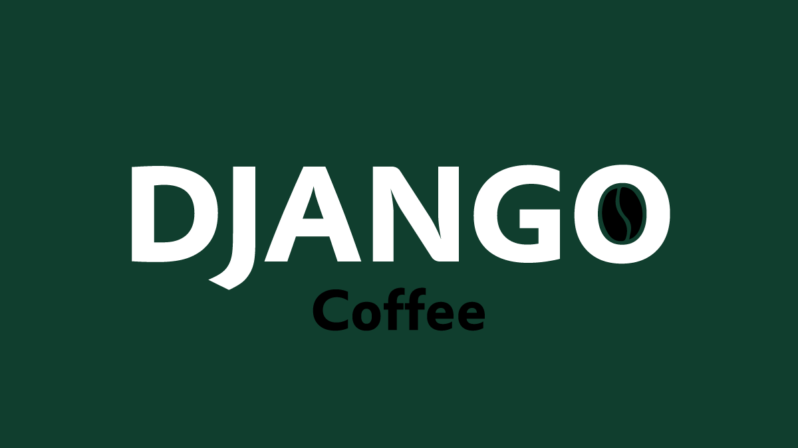

# DjangoCoffee

  

Hey there! 👋 Welcome this little github corner dedicated to all Django things ! Whether you're a seasoned developer or just getting started, this is the place to share :your problems,specific errors you got while developing a Django based project,solutions to others issues,a solution to a specific problem you solved, ask for help, or pitch in to make Dev with Django even easier by mentioning best Practices .

## How to Contribute

### Submitting your Issue

If you're facing a problem while developing a Django app , please submit an issue using the following guidelines:

1. **Search Before You Post**: Before submitting a new issue, please search the existing issues to see if your problem has already been addressed or discussed.

2. **Describe the Issue**: When submitting an issue, provide a clear and concise description of the problem you're experiencing. Include details such as the Django version you're using, relevant code snippets, and any error messages you've encountered.

3. **Reproducible Example**: Whenever possible, provide a minimal, reproducible example that demonstrates the issue. This helps others understand and diagnose the problem more effectively.

4. **Be Respectful**: Remember to be respectful and courteous to others in your interactions. We're all here to collaborate and help each other.

#### Please use English while commenting or subimitting an issue to make sure everyone gain knowledge .

### Contributing with problems , solutions or guides 

If you're eager to contribute by sharing issues, solutions, or even small tutorials, follow these steps:

1. **Fork the Repository**: Fork this repository to your own GitHub account.

2. **Create a Branch**: Create a new branch in your forked repository .

3. **Submit a Pull Request**: Once your changes are ready, submit a pull request to this repository. Be sure to provide a clear simple description on your readme.md .

## License

This repository is licensed under the [MIT License](LICENSE).
